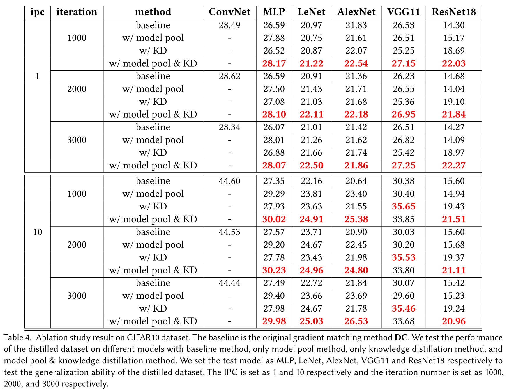

# Improve Cross-Architecture Generalization on Dataset Distillation

This is a joint work by [Binglin Zhou](https://github.com/Zhou-bl), [Linhao Zhong](https://github.com/zhongzero), and [Wentao Chen](https://github.com/John-Steve-C). More details are included in our [paper](./paper/Cross_Architecture_Generalization_on_Dataset_Distillation.pdf). 

## Abstract

Dataset distillation, a pragmatic approach in machine learning, aims to create a smaller synthetic dataset from a larger existing dataset. However, existing distillation methods primarily adopt a model-based paradigm, where the synthetic dataset inherits model-specific biases, limiting its generalizability to alternative models. In response to this constraint, we propose a novel methodology termed "model pool". This approach involves selecting models from a diverse model pool based on a specific probability distribution during the data distillation process. Additionally, we integrate our model pool with the established knowledge distillation approach and apply knowledge distillation to the test process of the distilled dataset. Our experimental results validate the effectiveness of the model pool approach across a range of existing models while testing, demonstrating superior performance compared to existing methodologies. 

## Experiment details

We test two methods for dataset distillation: model pool and knowledge distillation. The dataset is CIFAR-10. The main model is shown below:

| hyper parameter         | specific setting |
| ----------------------- | ---------------- |
| net width               | 128              |
| net depth               | 3                |
| net activation layer    | relu             |
| net normalization layer | instancenorm     |
| net pooling layer       | avgpooling       |

Other Random ConvNet in model pool:

| hyper parameter         | specific setting                              |
| ----------------------- | --------------------------------------------- |
| net width               | 128                                           |
| net depth               | 3                                             |
| net activation layer    | relu, sigmoid, leakyrelu, swish               |
| net normalization layer | instancenorm, batchnorm, layernorm, groupnorm |
| net pooling layer       | avgpooling, maxpooling                        |

## Results

This can be shown as the table.

